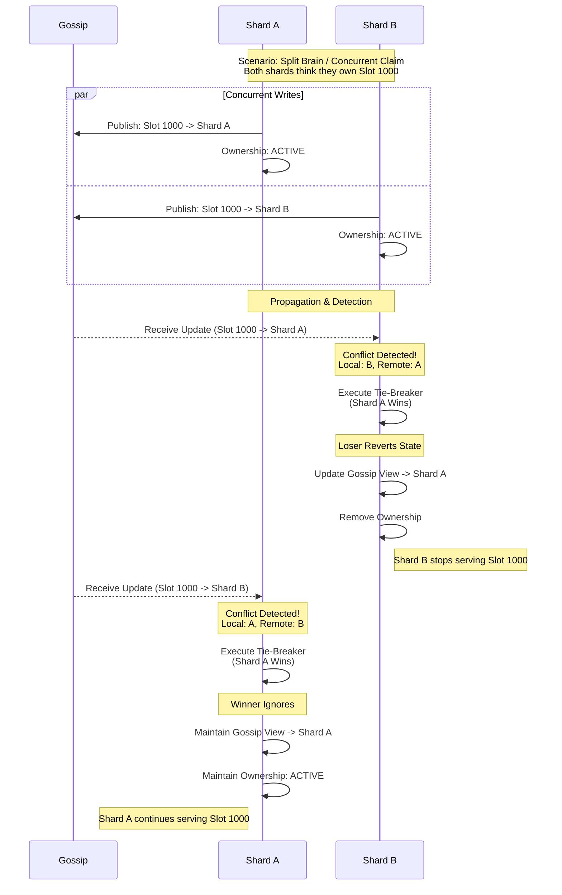
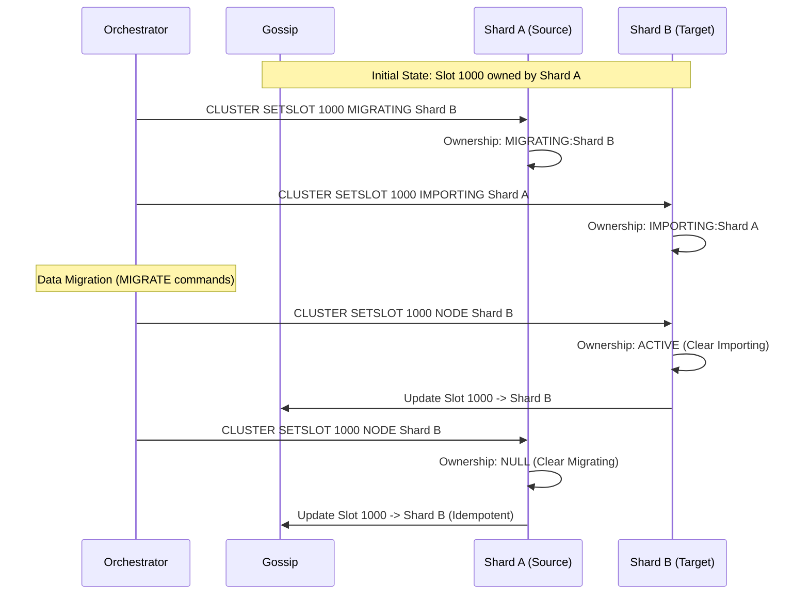
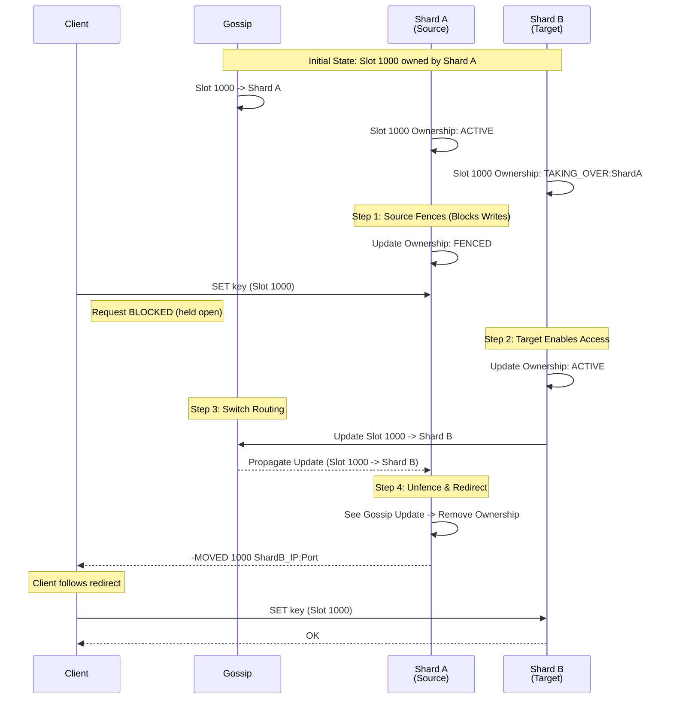
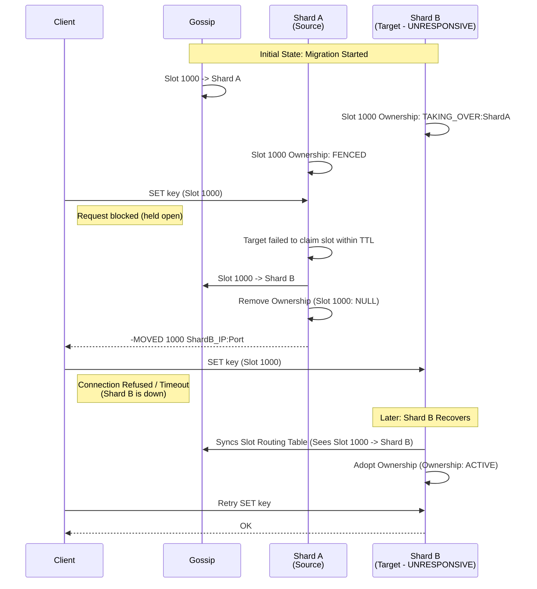
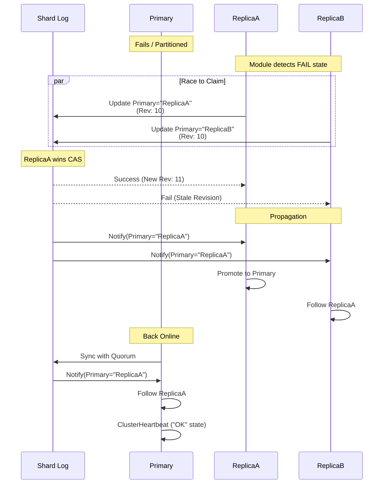
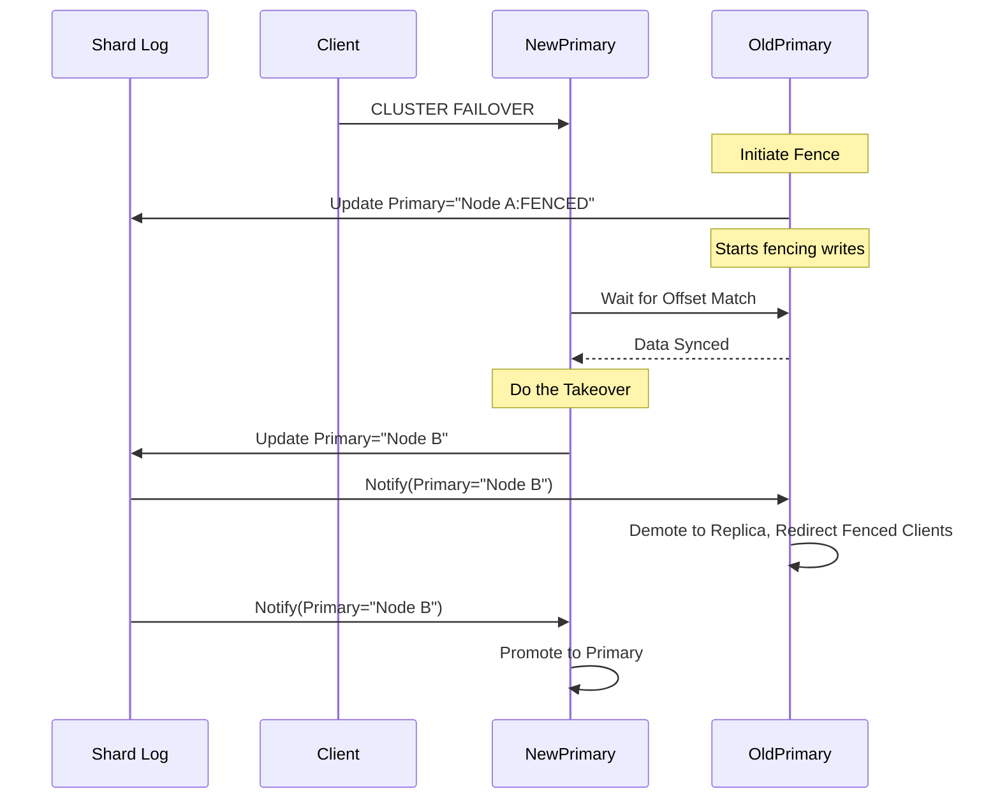
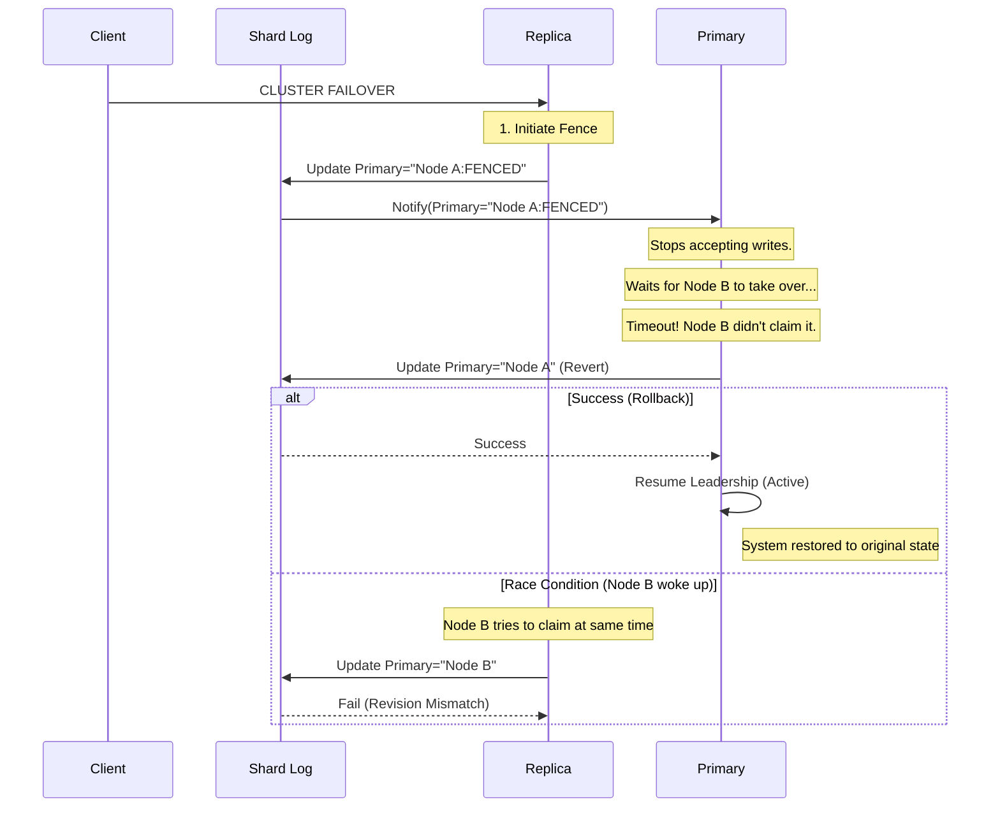

# Valkey Modular Clustering RFC

## Abstract

This RFC proposes a modular interface to decouple Valkey's cluster management
from its core execution engine, allowing for pluggable clustering
implementations via **Cluster Provider Modules**. Currently, Valkey’s clustering
logic is tightly coupled to the legacy Redis Cluster specification, preventing
the adoption of modern consensus algorithms.

This proposal defines a minimal API where the Module manages topology and
consistency while the Core maintains control over business logic and data
routing. Key architectural contributions include:

- Abstracted Membership: A push-based model where the Module informs the Core of
  topology changes, enabling diverse backends (e.g., Raft, Multi-Raft, or
  external stores like etcd).
- Opaque Metadata Layer: Two flexible key-value stores (one global and eventual,
  one shard-level and durable) allowing cluster state transitions without
  understanding the underlying implementation.
- Module Heartbeats: Modules send heartbeats to the Core periodically to inform
  that the cluster is in "OK" state. The Core does not interpret the underlying
  consensus state; it simply consumes the topology updates provided by the
  Module.

This interface aims to solidify the interaction between the Core and Clustering,
allowing both to evolve independently.

## Motivation

We’ve previously made an attempt to refactor clustering to support new
clustering systems in Valkey by refactoring cluster.c/h into cluster_legacy.c/h
and cluster.c/h. However, cluster.c is heavily coupled to the type of
implementation that cluster_legacy.c provides.

This proposal seeks to define a general purpose, minimal, clustering interface
allowing pluggable clustering implementations via module. Valkey cluster then
would operate in one of two modes:

- Cluster v1 - the existing implementation, which is used if no clustering
  module is supplied
- Module clustering - an arbitrary implementation of clustering that provides
  membership and metadata management.

The goal is not to reimplement cluster v1 as a module - this module API makes no
effort to support such a refactor. Cluster v1 requires the clustering to have a
deep understanding into all of Valkey's clustering metadata. The module-based
clustering interface is intended to provide a cleaner abstraction that is mostly
opaque to how the Valkey Core will use it. The goal is to provide a complete
enough API that the Core can build off of, without coupling the two components
and preventing independent growth.

Later, we can reuse this module-based system to ship new built-in clustering
modes (e.g. over Raft). Such implementations could use the same interfaces while
being statically loaded inside the Core itself.

To help with reading this proposal, the following architectures will be used as
potential cluster provider module implementations:

- **Cluster-Level Raft**: A clustering implementation that uses a global Raft
  group consisting of all cluster members.
- **Multi-Raft (Shard-Level Raft)**: A clustering implementation consisting of
  many per-shard Raft groups.
- **External (e.g. Etcd/Zookeeper)**: A clustering implementation that utilizes
  an external store for cluster management.

## Specification

## 1. Cluster Module Registration

Registration occurs through a module API:

```
/* Register your module as a cluster provider. This must be done in the
 * VM_ModuleLoad callback. May return an error if some other cluster provider is
 * registered (at most one provider can register).
int VM_RegisterClusterProvider(ValkeyModuleCtx *ctx, ClusterOps *ops)
```

For simplicity, Cluster Provider Modules will not support `MODULE UNLOAD`. The
Core will deny `MODULE UNLOAD` of a registered Cluster Provider.

### 1.1 ClusterOps Struct

ClusterOps is a versioned struct containing all the functions for Core -> Module
communication:

```
typedef void(*JoinClusterCallback)(int success, ValkeyModuleString *err);
typedef void(*RemoveFromClusterCallback)(int success, ValkeyModuleString *err);
typedef void(*JoinShardCallback)(int success, ValkeyModuleString *err);
typedef void(*RemoveFromShardCallback)(int success, ValkeyModuleString *err);

typedef struct ClusterOps {
   /* Struct version, for backwards compatibility */
   int version;

   /* ---------------------------- Membership ------------------------------ */
   /* Join into a cluster given some opaque endpoint information. E.g. CLUSTER
    * MEET <argv>. <argv> can be changed based on implementation.
    *
    * After joining or failing to join, the module should trigger the callback
    * with details. */
   int (*JoinCluster)(ValkeyModuleCtx *ctx, ValkeyModuleString *argv,
                      JoinClusterCallback callback);


   /* Remove the target node from my cluster. E.g. CLUSTER FORGET node-id. If
    * node-id is myself, gracefully remove my cluster membership.
    *
    * After removing or failing to remove, the module should trigger the
    * callback with details. */
   int (*RemoveFromCluster)(ValkeyModuleCtx *ctx, ValkeyModuleString *node_id,
                            RemoveFromClusterCallback callback);

   /* Join into a given shard within the cluster. E.g. CLUSTER REPLICATE.
    *
    * After joining or failing to join, the module should trigger the callback
    * with details. */
   int (*JoinShard)(ValkeyModuleCtx *ctx, ValkeyModuleString *shard_id,
                    JoinShardCallback callback);


   /* Remove the given node from my shard. If the node is myself, gracefully
    * remove my shard membership. E.g. CLUSTER REPLICATE NO ONE.
    *
    * After removing or failing to remove, the module should trigger the
    * callback with details. */
   int (*RemoveFromShard)(ValkeyModuleCtx *ctx, ValkeyModuleString *node_id,
                          RemoveFromShardCallback callback);

   /* ---------------------------- Metadata -------------------------------- */

   /* Defines a single update to metadata, whether gossiped or within the
    * per-shard Log. */
   struct ValkeyModuleClusterMetadataOperation {
      /* The key to update. If it doesn't exist, will be inserted. */
      ValkeyModuleString *key;
      /* The new value of the metadata */
      ValkeyModuleString *value;
      /* The expected current revision. If not the actual latest, the Module
       * must fail the operation. If the key does not currently exist, use
       * NULL. This provides compare-and-swap (CAS) semantics. */
      void *expected_revision;
   }

   enum ValkeyModuleGossipPropagation {
     /* Gossip to all shard members. */
     SHARD = 1,
     /* Gossip to all cluster members. */
     GLOBAL = 2
   }

   /* Callback when updating metadata. If success, a separate callback is
    * triggered through VM_ClusterProviderNotifyXUpdate API. */
    typedef void(*UpdateMetadataCallback)(int success);

   /* Update one or many pieces of gossiped metadata atomically.
    *
    * Gossiped metadata does not guarantee durability (i.e. eventual gossip,
    * CRDT-ish semantics).
    *
    * Upon success or failure, call the provided Callback function. Core will
    * handle it as needed. */
   int (*UpdateGossip)(ValkeyModuleCtx *ctx, size_t num_ops,
                       ValkeyModuleClusterMetadataOperation *ops,
                       ValkeyModuleGossipPropagation prop,
                       UpdateMetadataCallback callback);

   /* Update one or many pieces of shard-level metadata atomically and
    * consistently.
    *
    * Shard Log Metadata guarantees durability as long as the metadata operation
    * is successful (quorum semantics).
    *
    * Upon success or failure, call the provided Callback function. Core will
    * handle it as needed. */
   int (*UpdateShardLog)(ValkeyModuleCtx *ctx, size_t num_ops,
                         ValkeyModuleClusterMetadataOperation *ops,
                         UpdateMetadataCallback callback);
} ClusterOps;
```

## 2. Membership Callbacks

Cluster Provider Modules are the source of truth for all membership changes
(nodes joining, leaving, or switching shards). While the Core manages the data,
the Module manages the topology.

### 2.1 Example Membership Management

The Module handles membership commands (`JoinCluster`, `JoinShard`, etc.)
differently based on implementation. Here are three potential implementation
patterns:

| Lifecycle Event   | Cluster-Level Raft                                                                       | Multi-Raft (Shard-Level)                                                       | External (etcd/ZK)                                                                          |
| ----------------- | ---------------------------------------------------------------------------------------- | ------------------------------------------------------------------------------ | ------------------------------------------------------------------------------------------- |
| JoinCluster       | Join the global Raft group as a follower. Commit an entry creating a new shard for self. | Join cluster gossip network. Gossip self as a new node in a new empty shard.   | Connect to external store. Create an entry for self in a new shard. Start polling/watching. |
| JoinShard         | Commit entry: "Node X is now member of Shard Y."                                         | Run Raft config change to join Shard Y's Raft group.                           | Commit entry: "Node X is now member of Shard Y."                                            |
| RemoveFromShard   | Commit entry: "Node X moved to new empty Shard Z."                                       | Run Raft config change to leave Shard Y. Gossip self as member of new Shard Z. | Commit entry: "Node X moved to new empty Shard Z."                                          |
| RemoveFromCluster | Run Raft config change to remove node from global group.                                 | Broadcast "Ban/Tombstone" gossip for node ID.                                  | Delete node entry from external store. Stop polling.                                        |

### 2.2 Core <> Module Contract

Regardless of the underlying strategy, the Module must push the resulting
topology to the Core. The Core does not pull or poll for this state; it relies
entirely on the Module to invoke the update callback.

### 2.3 Membership Callback

```
/* Triggered by the Module whenever the cluster topology changes
 * (e.g., node added, node failed, shard reconfigured).
 */
void VM_ClusterProviderUpdateMembership(ValkeyModuleCtx *ctx,
                                        ClusterMembership *membership);
```

```
enum ClusterNodeState {
   OK = 1,    /* Node is healthy and active */
   PFAIL = 2, /* "Possible Failure" - locally detected unreachable */
   FAIL = 3   /* "Confirmed Failure" - agreed upon by consensus/threshold */
};

typedef struct ClusterNode {
   int version;
   char node_id[40];       /* Unique hex ID of the node */
   struct sockaddr_storage address; /* IP address */
   ClusterNodeState state; /* Current health state */
} ClusterNode;

typedef struct ClusterShard {
   int version;
   char shard_id[40];      /* Unique hex ID of the shard */
   size_t members_len;
   ClusterNode *members;   /* Array of nodes belonging to this shard */
} ClusterShard;

typedef struct ClusterMembership {
   int version;
   size_t shards_len;
   ClusterShard *shards;   /* Array of all known shards in the cluster */
} ClusterMembership;
```

**Note**: Membership data is intentionally minimal. Most clustering details will
be stored as opaque metadata to the Module.

## 3. Metadata Management

The Cluster Provider Module acts as an opaque storage layer for cluster
metadata. Metadata includes things such as:

- Shard primaryship
- Slot ownership
- Node information for `CLUSTER NODES`/`SLOTS` (hostname, human name, etc)
- Replication offsets
- Slot migration states
- Global state (e.g. configs, loaded functions)

Metadata is stored as key-value pairs.

### 3.1 Two Metadata Stores

Different pieces of metadata require fundamentally different consistency and
durability properties. Providing each metadata update this configurability would
cause a large explosion in complexity and requirements on the Module.

Instead of going that route, we will provide two metadata stores that satisfy
two classes of common problem:

1. **Gossip** - Metadata that provides no strong consistency or durability
   (similar to Cluster v1 gossip). Configurable propagation options.
2. **Shard Log** - shard-level metadata that provides strong consistency and
   durability (like Cluster v1 elections, but with stronger guarantees, and only
   within a shard).

The Gossip metadata and Log metadata are contained in two completely separate
namespaces. Modules are free to implement these how they see fit, and could even
use the same underlying storage for both. But the important parts are:

- Modules do not need to implement global consensus.
- Modules can optimize the Gossip metadata to prevent needless bottlenecking.
- Modules still provide strong shard-level consistency when it is needed.

### 3.2 Example Metadata Usage

To help understand how the Directory and Log are used, consider the following
metadata:

| Metadata Type               | Metadata Store  | Rationale                                                                                                                                                    |
| --------------------------- | --------------- | ------------------------------------------------------------------------------------------------------------------------------------------------------------ |
| Shard Primaryship (applied) | PER-SHARD LOG   | Failovers require shard consensus. Each shard has one primary at a time.                                                                                     |
| Shard Primaryship (routing) | GOSSIP (GLOBAL) | Directory has one owner per shard at a time and will eventually converge to one view cluster-wide.                                                           |
| Shard Slot Ownership        | PER-SHARD LOG   | Determines if the local shard accepts writes, denies writes, or fences them. Failover cannot cause this to be lost. Only the local shard should change this. |
| Slot Routing Table          | GOSSIP (GLOBAL) | Directory has one owner per slot at a time, and will eventually converge to one view cluster-wide.                                                           |
| Slot Migration States       | PER-SHARD LOG   | Source/Target shards must agree on migration states and keep them durable through failover.                                                                  |
| Node Port/IP                | GOSSIP (GLOBAL) | No consensus needed, but must be broadcast globally. Okay if it takes some time to propagate.                                                                |
| Replication Offset          | GOSSIP (SHARD)  | Node-level metadata that shard members need to know about for proper failover, but it doesn't need consensus and is okay if it is lost on restart/failover.  |

### 3.3 Core <> Module Contract

The Module must implement the following behaviors to satisfy the Core:

#### 3.3.1 Revisions

All updates include a `expected_revision`. The Module must fail the update if
the provided revision is stale. The Core will handle the failure (e.g. by
retrying or giving up).

Revisions are specified as `void*` pointers. Revisions are either:

- `NULL` - if no previous revision of the metadata exists (initial insert)
- A previously returned revision - if the engine is aware of a previous revision
  (update)

`void*` pointers are used to allow flexibility in how revisions are defined. The
details of this will be left to the Module (e.g. in Raft, it may include both
term and index).

#### 3.3.2 Visibility Callbacks

The Module must notify the Core when metadata becomes visible locally (via
propagation or local write).

```
/* Triggered when new metadata is detected in the gossip layer. */
void VM_ClusterProviderNotifyGossipUpdate(ValkeyModuleCtx *ctx,
                                          size_t num_ops,
                                          struct MetadataOperation []ops)

/* Triggered when new metadata is detected in the shard log. */
void VM_ClusterProviderNotifyShardLogUpdate(ValkeyModuleCtx *ctx,
                                            size_t num_ops,
                                            struct MetadataOperation []ops)
```

Modules can trigger this more often even if the value doesn't change, e.g. to
update the revision information.

#### 3.3.3 Gossip Metadata Conflict Resolution

Conflicts may arise when two nodes make conflicting gossip metadata changes
(e.g. two shards try to claim unowned slot 1000).

The Module is responsible for deterministic conflict resolution (e.g. logical
timestamp, vector clock, or strict ID ordering).

When a conflict is resolved, the Module must trigger
`VM_ClusterProviderNotifyGossipUpdate` with the winning value.

**Crucial**: Modules never silently update local metadata; they always fire the
callback so the Core stays in sync.

#### 3.3.4 Metadata Propagation

The module must propagate all Shard Log data to all shard members eventually.

Gossiped metadata supports configurable propagation options. This is because
some metadata simply does not need to be communicated across the entire cluster.
For this purpose, gossiped metadata can select between:

- `SHARD`: best effort attempt to propagate to current shard members (e.g.
  replication offset)
- `GLOBAL`: best effort attempt to propagate to all cluster members (e.g. slot
  routing, shard primaryship)

Note: propagation is expressed as minimum guarantees. Modules are free to
propagate beyond the specified scope (e.g. propagate SHARD to all nodes). For
that reason, the Core should ensure shard-gossipped metadata is globally unique
(e.g. by prefixing with node ID or shard ID).

#### 3.3.5 Local Restart Persistence

Upon local restart, the Module should re-bootstrap into the cluster. Before the
module can claim the cluster is in an "OK" state, it needs to sync up to the
latest Shard Log. If the re-bootstrapping node is to resume primaryship, the
synced view of the Shard Log should guarantee with confidence that primaryship
has not been transferred elsewhere. This would commonly be implemented via
lease, but the details are opaque to the Core.

Modules are expected to manage their own persistence of state to disk.

### 3.4 Example Implementations

Implementation details are left to the Module, but here are some examples:

|                           | Cluster-Level Raft                                                               | Multi-Raft (Shard Level)                                                                                          | External (etcd/ZK)                                          |
| ------------------------- | -------------------------------------------------------------------------------- | ----------------------------------------------------------------------------------------------------------------- | ----------------------------------------------------------- |
| Shard Log Writes          | All writes go to a single global Raft log, prefixed with Shard ID                | All writes go to the local shard Raft log                                                                         | All writes go to the external store, prefixed with Shard ID |
| Shard Log Propagation     | All nodes are members of the global Raft group, trigger callbacks when committed | All nodes are members of their shard Raft log, trigger callbacks when committed                                   | Nodes watch and/or poll keys in external store              |
| Gossip Writes             | All writes go to a single global Raft log                                        | All writes apply to the local view of gossip with incremented logical version                                     | All writes go to the external store                         |
| Gossip Conflicts          | N/A                                                                              | Conflicts deterministically handled when two nodes gossip a key with different values on the same logical version | N/A                                                         |
| Gossip Propagation        | All nodes are members of the global Raft group, trigger callbacks when committed | Gossip spreads the current view, merged with each node's local view                                               | Nodes watch and/or poll keys in external store              |
| Consistency Model         | Simple (all strongly consistent)                                                 | Complex (two consistency styles)                                                                                  | Simple (all strongly consistent)                            |
| Log Scalability           | Limited by global Raft                                                           | Scalable with shard count                                                                                         | Limited by external store                                   |
| Single point-of-failure?  | Maybe, if global Raft goes down                                                  | No, each shard Raft is independent                                                                                | Yes, cluster down if external store down                    |
| Implementation difficulty | Medium-Hard                                                                      | Hard                                                                                                              | Medium-Easy                                                 |

## 4. Failure Detection

### 4.1 Local Failure

There are a few distinct failure modes to consider:

1. Network partition separating a node from the majority
2. Core is down, Module is up
3. Core is up, Module is down

To handle 1) and 3), the Module is expected to provide periodic callbacks to the
Core indicating the health status of the current node. The status of the node
will be bounded by a maximum TTL:

```
/* Refresh the node's local OK status for the given time */
void VM_ClusterProviderClusterHeartbeat(mstime_t ttl)
```

Additionally, clustering providers can choose to cut this lifetime short
manually (e.g upon partition detection):

```
/* Immediately enter cluster down state, ignoring any remaining TTL */
void VM_ClusterProviderClusterDown()
```

Many modules will use the heartbeat to implement a leasing system in order to
detect network partitions. But it also serves to inform the Core that the Module
is still alive.

To handle 2), the Module should implement periodic heartbeats from the Core main
thread. They can do this using a number of methods (main thread timer callbacks,
event loop event registration, local PING requests to the Valkey port). It is
left to the modules to design this system.

### 4.2 Remote Failure

When the Module detects a remote failure, the Module is expected to callback via
`VM_ClusterProviderUpdateMembership`. Modules have the option of marking nodes
as either:

- `OK` - node is online, or began failing recently enough that it is yet to be
  marked unhealthy
- `PFAIL` - node is not yet canonically unhealthy (by the Module’s definition)
  but is locally unhealthy. It is not strictly needed, but will be client
  visible as PFAIL flag in the cluster topology
- `FAIL` - Node is canonically unhealthy (by the Module’s definition)

The Core will decide how to handle this (e.g. if my primary is `FAIL`, attempt
to update the shard primaryship to myself). The Module will design how this
detection works (e.g. mark a node as unhealthy if the lease is not refreshed
within 2x the timeout).

### 4.3 Primaryship is Metadata

As previously hinted, primaryship of nodes in the cluster is metadata, and not
membership information.

Certain Module implementations will likely have their own concepts of
primary/replica (leader/follower in Raft). Note that there is no effort in the
Core to align the clustering Module primary (should one exist) with the Valkey
data ownership concept. The Valkey Primaryship is just stored as opaque
metadata.

When failovers happen, modules may choose to implement hooks
(`VALKEYMODULE_EVENT_REPLICATION_ROLE_CHANGED` server event) to perform the
necessary failover in their consensus layer to align these two concepts. This
choice is left up to the Module and is not strictly required, but may make
implementation easier.

## 5 Cluster Formation and Operation Details

### 5.1 Cluster Bootstrap

Upon successful registration, the node will now belong to a cluster with just
the local node in a dedicated shard with no slots. The Module is expected to
callback on the following:

- `VM_ClusterProviderClusterHeartbeat` callback to enter "OK" cluster state
- `VM_ClusterProviderUpdateMembership` callback to update about the current
  cluster membership (which will just contain the local node in its own shard)

Once added, the Core will invoke `UpdateShardLog` to encode the primaryship of
the newly formed shard:

```
UpdateShardLog(...,
               ["primaryship", <my_node_id>, <revision>]
               ...)
```

### 5.2 Adding Nodes

Joining two independent nodes involves calling `JoinCluster` (`CLUSTER MEET`) on
one of those nodes. The Module would perform cluster membership adjustments,
then trigger a `VM_ClusterProviderUpdateMembership` callback on both nodes with
the new membership as well as callback on the provided JoinCluster callback with
success.

Node ID should be maintained when joining the cluster. Shard ID may change. The
clustering system would be expected to clear the shard-level and cluster-level
metadata upon entering a new cluster.

Once added to the cluster, the Core would be responsible for rebootstrapping the
metadata from the newly joined node similar to Cluster Bootstrap.

### 5.3 Shard Formation

Two nodes are then joined into a single shard via `JoinShard`
(`CLUSTER REPLICATE`) on either node. The Module would perform shard membership
adjustments, and fire `VM_ClusterProviderUpdateMembership` on all nodes in the
cluster. It will also fire a callback on the provided `JoinShard` callback with
success. The old shard and its metadata are destroyed.

Once committed and the callback is triggered, the Core can begin replication.

### 5.4 Slot Assignment

To the Module, a slot is just another metadata key. The Core maintains full
control over slot distribution.

Slot assignment is broken into two metadata pieces: one in the Gossip and one in
the Shard Log:

- The Gossip metadata we will refer to as the "Slot Routing Table" and is
  gossipped throughout the cluster for the purposes of routing.
- The Shard Log metadata we will refer to as the "Shard Slot Ownership" and is
  used to ensure the slot assignment is durable through failovers at the shard
  level.

For example, if `CLUSTER ADDSLOTS 1000` is called, the following metadata would
be committed:

```
/* In order to accept writes I must commit this to the shard quorum. */
UpdateShardLog(...,
               ["slot1000:state", value="ACTIVE", <revision>],
               ...)

/* Update the Directory to mark myself as the owner of slot 1000 */
UpdateGossip(...,
             ["slot1000:owner", <my_shard_id>, <revision>],
             ...)
```

#### 5.4.1 Handling Conflicts

Two nodes might claim the same slot in the Slot Routing Table simultaneously.
This could happen as the result of unsafe slot operations or if slots are
assigned to multiple shards upon initialization.

Following from **3.3.3 Conflict Resolution**, the Module must implement a
deterministic tie-breaker. This will result in at least one shard perceiving an
out-of-sync state between the committed Shard Slot Ownership and the Slot
Routing Table. When these two become out of sync, the Core will perform
compensating writes to the Shard Log to correct the Shard Slot Ownership.

Example:

1. Shard A and Shard B both `UpdateGossip` claiming "Slot 1000" in the Slot
   Routing Table.
2. Both modules succeed and both Cores see success.
3. Eventually, Shard A's update reaches Shard B (and vice versa). The Module
   detects a conflict on the same key.
4. **Resolution:**
   - The Winner (Shard A): Sees the conflict but knows it won. No action needed;
     its local state is already correct.
   - The Loser (Shard B): Sees the conflict and knows it lost. It must:
     - Fire
       `VM_ClusterProviderNotifyGossipUpdate(["slot1000:owner", "shard_A", <revision>])`
       so the Core updates its routing table.
     - Upon notification that the slot routing table was reverted, the Core
       needs to do corrective actions to remove the slot assignment from the
       shard (remove Shard Slot Ownership) and delete the dirty keys.

<details>

<summary>Sequence Diagram</summary>



</details>

**Important**: If Slot Migration is followed as outlined in **5.5 Slot
Migration**, Slot Routing Table conflicts should not occur as it uses two-phase
commit across the two Shard Logs.

#### 5.4.2 Shard Slot Ownership States

Encoding a consistent Shard Slot Ownership state in the Shard Log ensures that
before any writes are accepted, the acceptance of that slot is made
shard-durable. This prevents scenarios where a failover causes the ownership of
the slot to be lost.

These Barriers also prove very useful when doing slot migrations across shards,
as we can expand the ownership state to support slot migration states. The
following states are supported:

- `"ACTIVE"`: Reads and writes are being actively served on this slot within
  this shard.
- `"TAKING_OVER:<shard_id>"`: (Atomic Slot Migration) We are in the process of
  taking over the slot.
- `"FENCED"`: (Atomic Slot Migration) Reads and writes are being fenced
  (temporarily blocked) due to an in-progress slot migration.
- `"MIGRATING:<shard_id>"`: (Legacy Slot Migration) Reads and writes are being
  actively served on this slot within this shard, however we are attempting to
  transfer it to the given Shard ID.
- `"IMPORTING:<shard_id>"`: (Legacy Slot Migration) Reads and writes are being
  actively served on this slot within this shard, however we are attempting to
  transfer it from the given Shard ID.
- `""` (disabled): No reads and writes are being served on this shard.

### 5.5 Slot Migration

Migration is a distributed state machine involving two shards: the Source
(sending data) and the Target (receiving data). The Core uses the metadata layer
to ensure data safety through Two-Phase Commit (2PC) across the two Shard Logs.

#### 5.5.1 Legacy Slot Migration

Example (migrating slot 1000 from node A in shard A to node B shard B):

- On Source: `CLUSTER SETSLOT 1000 MIGRATING node_B`

  ```
  UpdateShardLog(...,
                 ["slot1000:state", "MIGRATING:shard_B", <revision>]
                 ...);
  ```

  Note: here and below we convert node to shard for storing in shard log

- On Target: `CLUSTER SETSLOT 1000 IMPORTING node_A`
  ```
  UpdateShardLog(...,
                 ["slot1000:state", "IMPORTING:shard_A", <revision>],
                 ...);
  ```

After data is moved, ownership must switch.

1. On Target: `CLUSTER SETSLOT 1000 NODE node_B`

   ```
   /* Clear import state */
   UpdateShardLog(...,
                  ["slot1000:state", "ACTIVE", <revision>]
                  ...);

   /* Claim ownership */
   UpdateGossip(...,
                ["slot1000:owner", value="shard_B", <revision>]
                ...);
   ```

2. On Source: `CLUSTER SETSLOT 1000 NODE node_B`

   ```
   /* Acknowledge new ownership */
   UpdateGossip(...,
                ["slot1000:owner", value="shard_B", <revision>]
                ...);

   /* Clear migrating state */
   UpdateShardLog(...,
                  ["slot1000:state", "", <revision>]
                  ...);
   ```

**Note**: If the Target's Slot Routing Table message propagates to the Source
before the orchestrator triggers Step 2, the Source's Core will see the
conflict, recognize the higher revision, and automatically commit the change to
the Slot Ownership State. In this case, Step 2 becomes a no-op.

<details>

<summary>Sequence Diagram</summary>



</details>

#### 5.5.2 Atomic Slot Migration

Example (migrating slot 1000 from shard A to shard B):

1. On Target: `CLUSTER SYNCSLOTS PAUSE`:
   ```
   /* Encode that we are planning to takeover the slot */
   UpdateShardLog(...,
                  ["slot1000:state", "TAKING_OVER:shard_A", <revision>]
                  ...);
   ```
1. On Source: `CLUSTER SYNCSLOTS REQUEST-FAILOVER`
   ```
   /* While the fence is in place, all clients reading or writing to the slot
    * will be temporarily blocked. */
   UpdateShardLog(...,
                  ["slot1000:state", "FENCED", <revision>]
                  ...);
   ```
1. On Target: `CLUSTER SYNCSLOTS FAILOVER-GRANTED`

   ```
   /* Ensure shard-level consensus before accepting writes */
   UpdateShardLog(...,
                  ["slot1000:state", "ACTIVE", <revision>]
                  ...);

   /* Claim ownership */
   UpdateGossip(...,
                ["slot1000:owner", value="shard_B", <revision>]
                ...);
   ```

1. On Source: Slot Routing Table metadata propagates
   - The Source Core sees `owner="shard_B"` (which supersedes its local state).
   - The callback triggers the removal of the fence:

   ```
   /* Clear ownership state, removing fence */
   UpdateShardLog(...,
                  ["slot1000:state", "", <revision>]
                  ...);
   ```

   - Clients that were previously blocked are now unblocked

<details>

<summary>Sequence Diagram</summary>



</details>

**Timeout / Failure Mode**: If the Target fails to claim the slot within a
timeout, the Source has two options:

1. (CP option in CAP theorem): force the completion and send clients to a shard
   that may deny them
2. (AP option in CAP theorem): revert to serving the slot and risk dual
   ownership

In Option 1, we set `owner="shard_B"` in the Slot Routing Table and set
`state=""` to remove the `FENCED` state from the Shard Slot Ownership. Clients
would then get the `-MOVED` redirect. If Shard B is up and has taken over the
slot, but Source just hasn't heard, no problem exists. If Shard B is down or has
not yet taken over the shard (e.g. lost the FAILOVER-GRANTED message), the
clients redirected to Shard B will get an error (`-MOVED`). Upon Shard B coming
back online, conflict resolution in the Slot Routing Table will result in
finalization of the migration. Otherwise, since the `TAKING_OVER` state is
persisted, we need to do some work to clear that. We can restart the two-phase
commit, and if denied failover, clear the `TAKING_OVER` state.

Two important notes about Option 1:

- We do not ever leave the `FENCED` state once it is committed. The only way out
  from there is via completing the migration.
- We do not ever leave the `TAKING_OVER` state without re-attempting two-phase
  commit idempotently. We can only clear this state upon a rejected two-phase
  commit or upon successful migration. This is the only way to know if the
  source shard forced the migration through.

In Option 2, we can simply set the Source Shard Slot Ownership to
`state="ACTIVE"`. If the slot migration did go through, we will now have two
simultaneous primaries. Slot Routing Table reconciliation will eventually result
in one losing ownership, in which case the writes it had accepted will now be
lost.

<details>

<summary>Option 1: Sequence Diagram</summary>



</details>

### 5.6 Topology Discovery and Routing

Cluster membership is continuously pushed from the Module to the Core through
callbacks as previously described. The globally visible metadata (slots,
hostnames, human nodenames, other aux data) can be joined with the membership
data to produce `CLUSTER NODES`, `CLUSTER SLOTS`, and `CLUSTER SHARDS`
responses.

`-MOVED` redirections would also rely on the slot ownership in the metadata.
Since all metadata is pushed from the Module to the Core, the Core does not need
to invoke the Module on the hot path for redirections. It can use its most
recent cached topology.

### 5.7 Shard Failover

Failover is the mechanism of switching write authority within a shard.

Failover is controlled exclusively by a `SHARD` scoped primaryship key. When
shards are first formed upon `JoinCluster`, this key is bootstrapped like so:

```
UpdateShardLog(...,
               ["primaryship", "node_A", <revision>]
               ...)
```

#### 5.7.1 Automatic Failover

As per **4.2 Remote Failure**, the Module will detect when remote nodes become
unhealthy and inform the Core through `VM_ClusterProviderUpdateMembership`
callbacks. The Module can implement this health signal as it sees fit (e.g.,
Raft timeouts, gossip failure).

When the Core on a replica notices that its primary is marked as `FAIL` through
this callback they can simply update the primaryship through the Shard Log:

```
UpdateShardLog(...,
               ["primaryship", "node_B", <revision>]
               ...)
```

Since this is a durable and consistent write using CAS properties, only one will
succeed at the given revision. The succeeding node is now the primary.

Replicas in the shard will learn of the new primaryship through
`VM_ClusterProviderNotifyShardLogUpdate` callbacks and reconfigure replication.

**Important**: Nodes must sync to the latest Shard Log before re-entering the
cluster "OK" state. This will guarantee that when the demoted node comes back
online, it will read the metadata update that demoted it and configure as a
replica. After this, the module can call the
`VM_ClusterProviderClusterHeartbeat` callback to re-enter cluster "OK" state.

<details>

<summary>Sequence Diagram</summary>



</details>

#### 5.7.2 Manual Failover

A user may request a failover (e.g., `CLUSTER FAILOVER`) on a specific replica.

The Core will manage syncing the data up to the latest offset on the specified
replica. It will do so by applying a fence, similar to atomic slot migration:

```
/* Node A retains primaryship, but should fence incoming clients. */
UpdateShardLog(...,
               ["primaryship", "node_A:FENCED", <revision>]
               ...)
```

Once the manual failover enters finalization, the Core will commit the following
metadata change from the new primary (in this case, Node B):

```
/* Set Node B as the shard-level primary with QUORUM. */
UpdateShardLog(...,
               ["primaryship", "node_B", <revision>]
               ...)
```

<details>

<summary>Sequence Diagram</summary



</details>

**Timeout/Recovery**: Should the demoting primary (Node A) timeout waiting for
the new primary (Node B) to take over, Node A can simply revert the fence and
reclaim ownership:

```
/* Revert fence and resume leadership */
UpdateShardLog(...,
               ["primaryship", "node_A", <revision>]
               ...);
```

**Why this is safe**: Unlike Slot Migration (which spans two consensus groups),
Failover occurs within a single shard's consensus scope. If Node A attempts to
revert at the same time Node B attempts to takeover, the CAS check (revision)
ensures only one write succeeds. There is no risk of split-brain.

<details>

<summary>Sequence Diagram</summary



</details>
